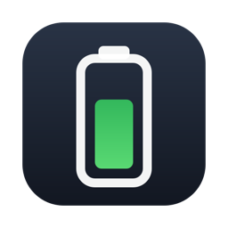
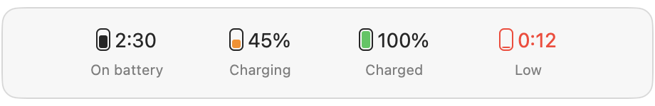
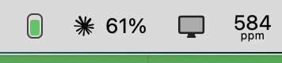
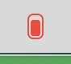
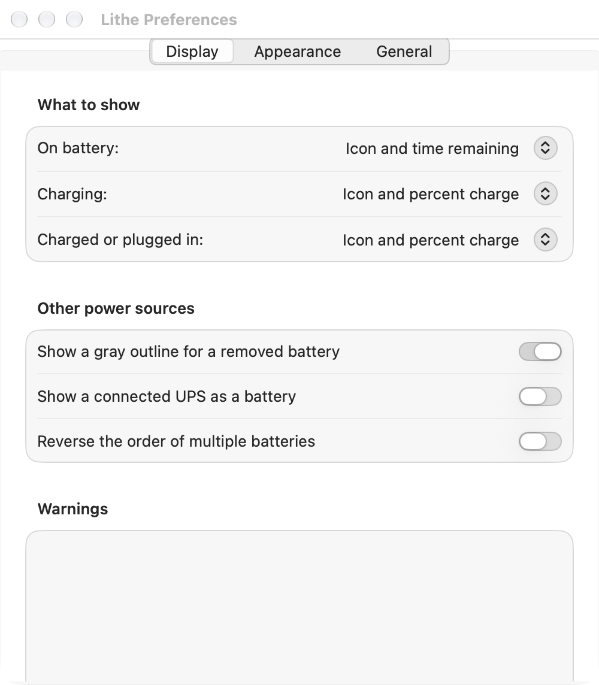
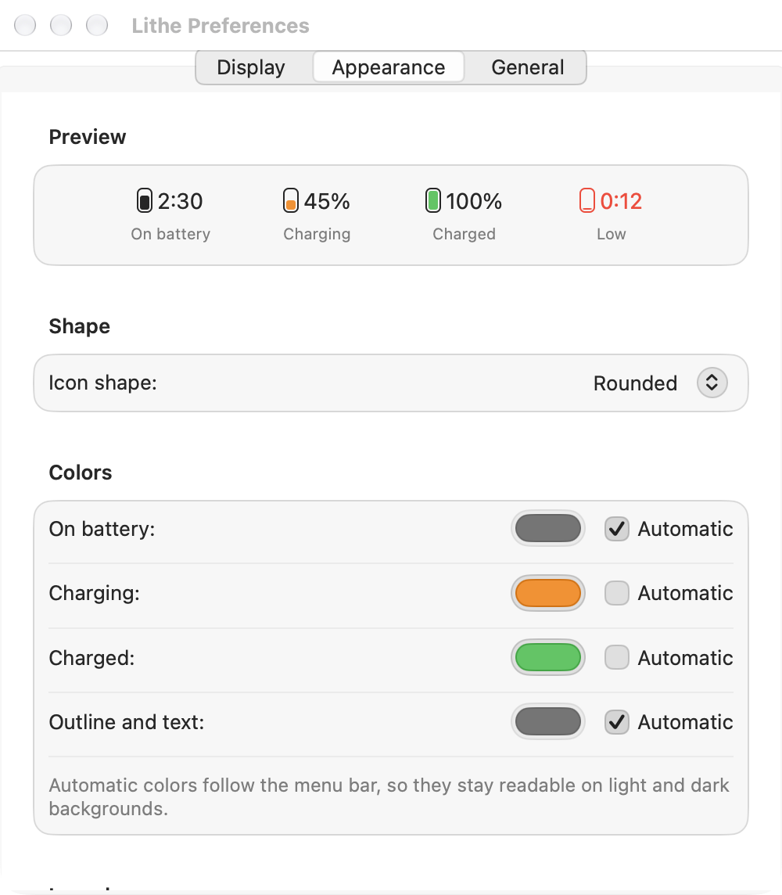
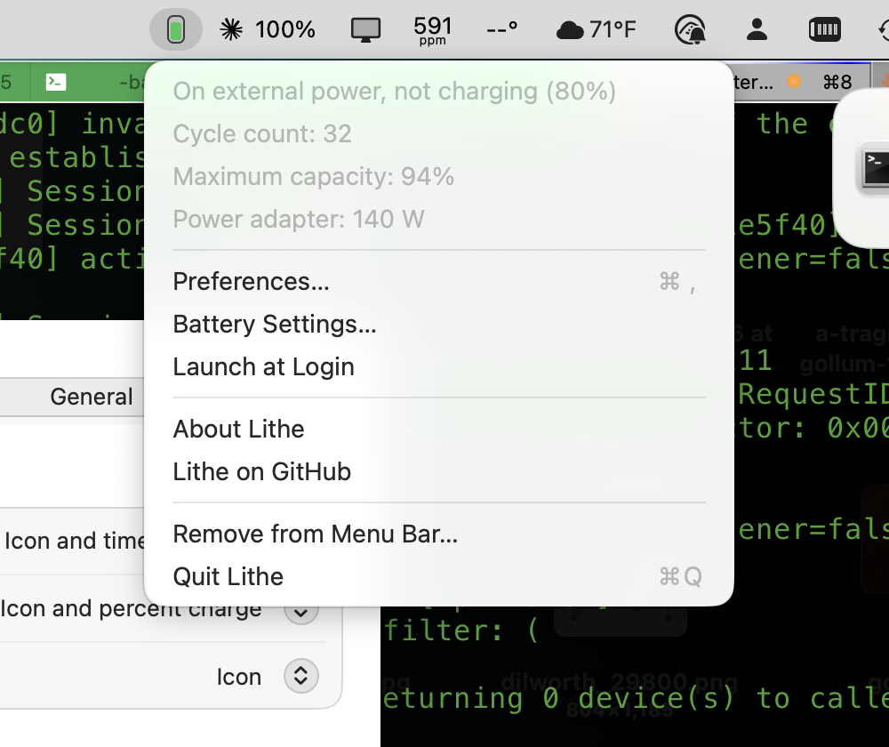
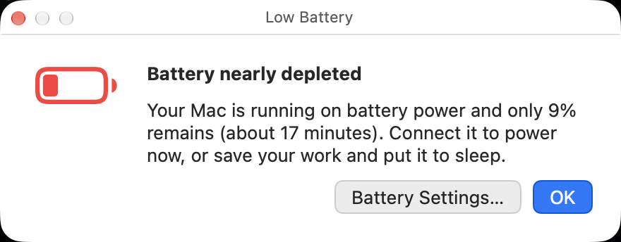

<p align="center">
  
</p>

# Lithe

A slim, configurable battery meter for the macOS menu bar.

Lithe is a from-scratch, open source successor to
[SlimBatteryMonitor](http://www.orange-carb.org/SBM/), the classic replacement
power gauge that stopped working with recent macOS releases and was never
built for Apple silicon. Like the original, it shows exactly the information
you want, in the space you want, and nothing else.

<p align="center">
  
</p>

<p align="center">
  
  
</p>

## Features

- **Choose what to show in each state.** On battery, while charging, and when
  charged or plugged in, show any of: the icon, icon and percent, icon and time
  remaining, percent only, time only, or nothing at all.
- **Five icon shapes:** rectangular, rounded with terminal, thin, rounded, and
  horizontal (with the text above the meter).
- **Colors that fit your menu bar.** Fill colors for each state, plus the
  outline and text color, are either automatic (they follow the light or dark
  menu bar) or any color you pick. The icon turns a warning color below a
  charge level you choose.
- **Low-battery warning panel** with a sound when the charge drops below your
  threshold, in addition to the color change.
- **Useful menu:** the current state and estimate in words, cycle count,
  maximum capacity, power adapter wattage, and Low Power Mode.
- **Removed batteries, multiple batteries, and UPS units** are handled like the
  original: show a gray outline for a missing battery, treat a connected UPS as
  a battery, and reverse the order if it does not match your hardware.
- **Launch at login** from the preferences or the menu, using the modern
  `SMAppService` API.
- **Remove from the menu bar** for the rest of the session or forever, from the
  menu or by ⌘-dragging the icon out of the menu bar.
- **Imports your SlimBatteryMonitor settings** (display modes, shape, and
  thresholds) the first time it runs.
- Native Swift, no dependencies, tiny footprint. Universal binary for Apple
  silicon and Intel; macOS 14 (Sonoma) or later.

<p align="center">
  
  
</p>

<p align="center">
  
  
</p>

## Install

Download `Lithe-<version>.zip` from the
[latest release](https://github.com/asmeurer/Lithe/releases/latest), unzip it,
and drag `Lithe.app` to your Applications folder. Open it once; a battery icon
appears in the menu bar. Click the icon and turn on **Launch at Login** so it
comes back after a restart.

Releases are not notarized unless a Developer ID certificate is configured, so
macOS may say the app cannot be checked for malicious software. Allow it in
**System Settings > Privacy & Security** (scroll down to "Open Anyway"), or
build it yourself:

```bash
git clone https://github.com/asmeurer/Lithe.git
cd Lithe
brew install xcodegen   # generates the Xcode project from project.yml
make install            # universal Release build copied to /Applications
```

## Coming from SlimBatteryMonitor

- Quit SlimBatteryMonitor and remove it from **System Settings > General >
  Login Items** (it is an Intel app that will not run on future macOS versions).
- Lithe reads SlimBatteryMonitor's display settings on first launch: what to
  show in each state, the icon shape, the warning-color threshold, and the
  warning-panel threshold. Colors are not imported, because the old black
  defaults are invisible on a dark menu bar; Lithe's automatic colors adapt
  instead.
- Lithe's display modes and shapes match the originals one to one. The
  horizontal shape prints the text above the meter, as before.

## Build from source

Requirements: Xcode 16 or later and [xcodegen](https://github.com/yonaskolb/XcodeGen)
(`brew install xcodegen`). SwiftLint is optional.

```bash
make            # Debug build
make run        # Build and launch
make test       # Run the tests
make release    # Universal Release build, zipped into dist/
make project    # Regenerate Lithe.xcodeproj from project.yml (then open it in Xcode)
```

`Lithe.xcodeproj` is generated from `project.yml` and not committed; run
`make project` after adding files and edit `project.yml` for build settings.

### How it works

Lithe reads the same IOKit power source information that the system battery
menu uses (`IOPSCopyPowerSourcesInfo`) and is notified by IOKit whenever the
charge, state, or time estimate changes. Battery health details come from the
`AppleSmartBattery` entry in the I/O Registry. The menu bar image is drawn on
the fly with AppKit, so it is crisp at any scale and automatic colors resolve
against the actual menu bar appearance. The preferences window is SwiftUI.

## License

MIT. See [LICENSE](LICENSE).

Lithe is not affiliated with SlimBatteryMonitor or its author, Colin Henein;
it re-creates the idea, not the code.
